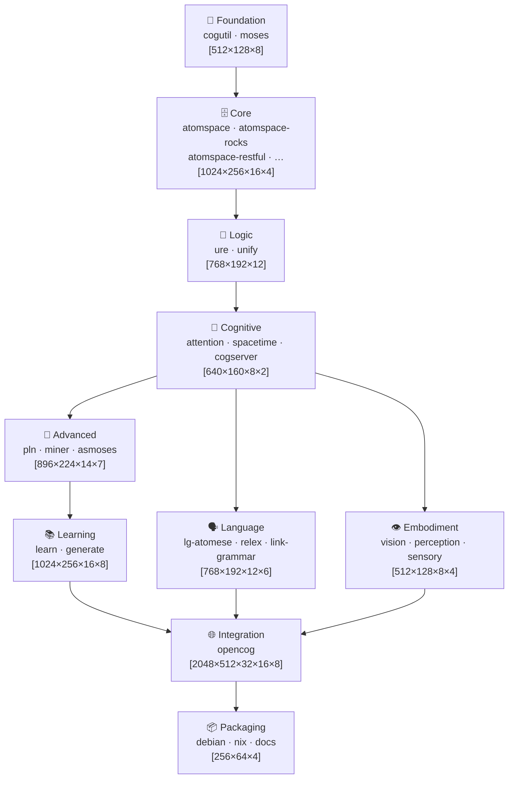

# GitHub Actions Architecture — OpenCog Unified

## Overview

This document describes the cognitive architecture layers used by the
`ontogenesis-orchestration` GitHub Actions workflow. The workflow dynamically
generates build and issue-tracking jobs by parsing the layer hierarchy and
tensor shapes defined here.

## Cognitive Layer Hierarchy

The OpenCog Unified build system is organised as a ten-layer cognitive stack.
Each layer depends on the layers beneath it and is characterised by a tensor
shape that encodes the dimensionality of the cognitive sub-space it occupies.



## Layer Definitions

### Layer 0 — Foundation

| Property | Value |
|---|---|
| **Components** | `cogutil`, `moses` |
| **Tensor shape** | `[512, 128, 8]` |
| **Degrees of freedom** | 1 |
| **Cognitive function** | `utility-primitives` |
| **Description** | Pure utilities and basic functions |
| **Dependencies** | _(none)_ |

### Layer 1 — Core

| Property | Value |
|---|---|
| **Components** | `atomspace`, `atomspace-rocks`, `atomspace-restful`, `atomspace-websockets`, `atomspace-metta` |
| **Tensor shape** | `[1024, 256, 16, 4]` |
| **Degrees of freedom** | 2 |
| **Cognitive function** | `knowledge-representation` |
| **Description** | Hypergraph representation and storage |
| **Dependencies** | `foundation` |

### Layer 2 — Logic

| Property | Value |
|---|---|
| **Components** | `ure`, `unify` |
| **Tensor shape** | `[768, 192, 12]` |
| **Degrees of freedom** | 3 |
| **Cognitive function** | `logical-inference` |
| **Description** | Reasoning and unification |
| **Dependencies** | `core` |

### Layer 3 — Cognitive

| Property | Value |
|---|---|
| **Components** | `attention`, `spacetime`, `cogserver` |
| **Tensor shape** | `[640, 160, 8, 2]` |
| **Degrees of freedom** | 4 |
| **Cognitive function** | `attention-allocation` |
| **Description** | Attention, space, time, emergence |
| **Dependencies** | `logic` |

### Layer 4 — Advanced

| Property | Value |
|---|---|
| **Components** | `pln`, `miner`, `asmoses` |
| **Tensor shape** | `[896, 224, 14, 7]` |
| **Degrees of freedom** | 5 |
| **Cognitive function** | `emergent-reasoning` |
| **Description** | Pattern recognition, probabilistic logic, learning |
| **Dependencies** | `cognitive` |

### Layer 5 — Learning

| Property | Value |
|---|---|
| **Components** | `learn`, `generate` |
| **Tensor shape** | `[1024, 256, 16, 8]` |
| **Degrees of freedom** | 6 |
| **Cognitive function** | `adaptive-learning` |
| **Description** | Multi-modal learning systems |
| **Dependencies** | `advanced` |

### Layer 6 — Language

| Property | Value |
|---|---|
| **Components** | `lg-atomese`, `relex`, `link-grammar` |
| **Tensor shape** | `[768, 192, 12, 6]` |
| **Degrees of freedom** | 7 |
| **Cognitive function** | `language-cognition` |
| **Description** | Natural language processing |
| **Dependencies** | `cognitive` |

### Layer 7 — Embodiment

| Property | Value |
|---|---|
| **Components** | `vision`, `perception`, `sensory` |
| **Tensor shape** | `[512, 128, 8, 4]` |
| **Degrees of freedom** | 8 |
| **Cognitive function** | `embodied-cognition` |
| **Description** | Sensory and motor integration |
| **Dependencies** | `cognitive` |

### Layer 8 — Integration

| Property | Value |
|---|---|
| **Components** | `opencog` |
| **Tensor shape** | `[2048, 512, 32, 16, 8]` |
| **Degrees of freedom** | 9 |
| **Cognitive function** | `unified-consciousness` |
| **Description** | Complete cognitive system |
| **Dependencies** | `learning`, `language`, `embodiment` |

### Layer 9 — Packaging

| Property | Value |
|---|---|
| **Components** | `debian`, `nix`, `docs` |
| **Tensor shape** | `[256, 64, 4]` |
| **Degrees of freedom** | 1 |
| **Cognitive function** | `distribution-membrane` |
| **Description** | Deployment orchestration |
| **Dependencies** | `integration` |

## Dependency Graph

```
foundation
  └─► core
        └─► logic
              └─► cognitive
                    ├─► advanced
                    │     └─► learning
                    │             └─► integration ─► packaging
                    ├─► language ──────────────────────┘  │
                    └─► embodiment ────────────────────────┘
```

## Usage

The `ontogenesis-orchestration.yml` workflow reads this file at runtime to
validate that the architecture document exists before generating the dynamic
job matrix. The matrix itself is derived from the layer definitions hard-coded
in the `Parse Architecture from Mermaid` step.
